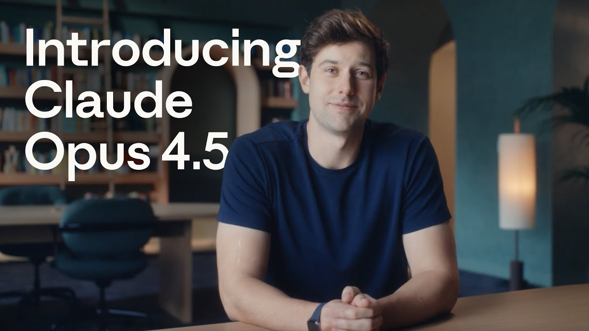
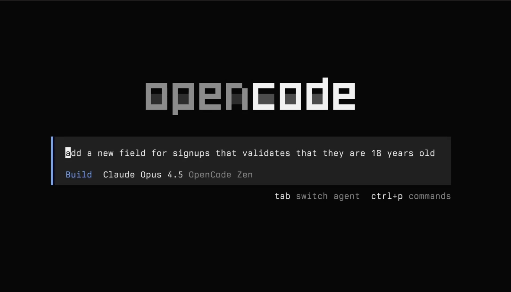
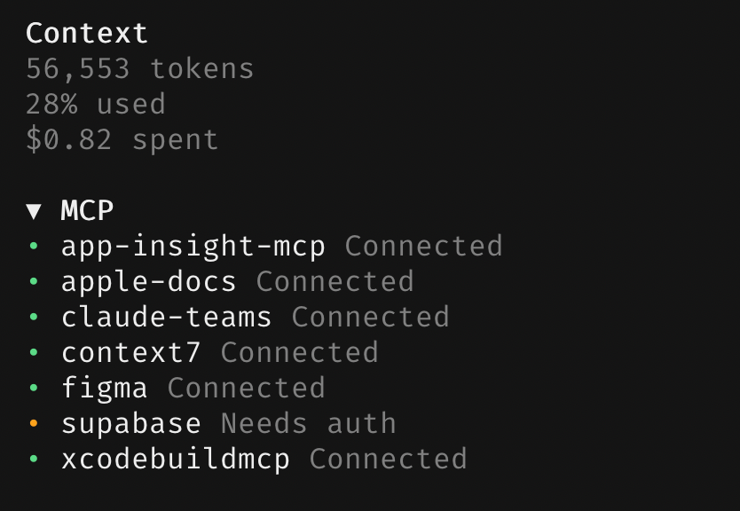

I've been putting this off for a while. The last three months have been the most disorienting, exciting, and productive stretch of my career as a systems engineer — and almost none of it came from the systems I manage at work. It's been AI. Specifically, the firehose of model releases and tooling that started in November 2025.

I need to get this out before the next wave hits and I lose what it felt like when things started clicking.

## The Moment It Changed: Claude Opus 4.5

I'd been poking at AI coding tools on and off for most of 2025. They were sometimes useful, often frustrating. The models could write code, sure, but getting them to actually *do work* — plan a multi-step task, call the right tools, and not lose the thread halfway through — was painful. Agentic AI sounded great in theory. In practice? Not for me.

Then on November 24, 2025, Anthropic dropped Claude Opus 4.5, and something shifted.

It wasn't just that it was smarter. For the first time, a model could handle long-horizon planning, sustained tool use, and agentic tasks without falling apart. Anthropic called it the best model in the world for coding, agents, and computer use — and it held up. You could point it at a complex, multi-system problem, and it would figure out the fix, build a plan, and execute. I'd tried this before with earlier models and it always turned into babysitting. Opus 4.5 was the first time I could kick off a task, step away, and come back to something that actually worked.

That was the unlock. That was when I went from "AI is a neat toy" to "okay, I need to rethink how I work."

## Agent Harnesses: Where the Real Magic Happens

Claude Code was my first real agent harness. Terminal-based, tightly integrated with Anthropic's models, and good at sustained coding sessions. If you're on an Anthropic subscription and you haven't tried it, you're missing out.

But I wanted to try other models. The open-source space was heating up, and I wanted to run capable models through the same kind of agentic workflows. So I started looking around.

**OpenCode** became my go-to for model flexibility. It's an open-source agent that supports 75+ models from every major provider, over 100k stars on GitHub. I could swap between Claude, Kimi K2 Thinking, MiniMax M2.2, GLM models — whatever fit the problem. The ability to Bring Your Own Key (BYOK) without switching tools was useful.

**Factory Droid** impressed me with its enterprise approach, and I've been reaching for it more often. It runs in your terminal like Claude Code but supports Anthropic, OpenAI models and open-source options through their "Droid Core" offering, or you can BYOK. The subscription gives you a decent token allowance, and different models pull different amounts from your pool — some cheaper, some pricier — so you can use a heavy-hitter like Opus for planning and a faster model for execution without doing mental math on API bills. Not being locked to one company's models is a big deal. Their approach to specialized "Droids" for different tasks (coding, debugging, reviewing) maps well to how I break down work.

## Open-Source Models Caught Up (Kind of)

Here's where it gets interesting. Starting in November, the open-source model releases came fast, and the quality jump was real.

**Kimi K2 Thinking** (November 6, 2025) from Moonshot AI was early in this wave. A trillion-parameter MoE model with solid reasoning — one of the first open-weight models that felt genuinely competitive on coding tasks. Then on January 27 they released **Kimi K2.5**, which added native multimodal capabilities and was a jump in intelligence, getting close to Sonnet 4.5 for a fraction of the price.

**Z.ai** (formerly Zhipu AI) had a good run. It started back in July 2025 with **GLM-4.5**, their native agentic LLM with one-click compatibility with the Claude Code framework — an early signal that open-source models were taking agentic workflows seriously. Then they dropped **GLM-4.7** on December 22, which was the first open-source model I used that could reliably do "think-then-act" execution in agent frameworks. It ranked #1 among open-source models on agentic coding benchmarks at the time. Then, two weeks ago on February 11, they released **GLM-5** — a 744B parameter model that topped open-source leaderboards across reasoning, coding, and agentic tasks. Their paper was called "From Vibe Coding to Agentic Engineering," which sums up the shift.

**MiniMax M2.2** dropped February 12, scoring 80.2% on SWE-bench Verified — close to Opus 4.5's 80.9% — while costing roughly a tenth to a twentieth of the price. The efficiency is striking.

Here's my take: these open-source models are *really good* at raw coding. On benchmarks, they're competitive with closed models from Anthropic and OpenAI. But where they still struggled — and this is the thing that drove most of my tooling choices — was in **following tool calls and instructions reliably**. They could write the code, but they'd stumble when asked to use tools in sequence, maintain context across long agent sessions, or follow complex multi-step plans without going off the rails.

This is the gap that frameworks like GSD and Superpowers exist to fill.

## Frameworks That Make Open-Source Models Actually Work

**GSD (Get Shit Done)** is a meta-prompting and spec-driven development system that sits on top of your agent harness. The core idea: instead of letting the model manage its own context (which leads to "context rot" — quality degradation as the session gets longer), GSD orchestrates the work by spawning fresh sub-agents for each task, each with a clean 200K token context window.

For open-source models that are great at coding but shaky at long-horizon planning, this compensates for exactly that weakness. You use a strong model for planning (where decisions matter), and route execution to a cheaper, faster model that just needs to follow instructions. GSD supports Claude Code, OpenCode, Gemini CLI, Codex, and more. It's open-source, MIT-licensed, and moving fast.

**Superpowers**, by Jesse Vincent, takes a different but complementary approach. It's an agentic skills framework — a library of composable skills that teach your agent engineering best practices: TDD, subagent-driven development, structured brainstorming, git worktree workflows. Where GSD solves the context management problem, Superpowers solves the "the model technically *can* do this, but it doesn't know *how* I want it done" problem. It injects methodology. It works across Claude Code, Codex, and OpenCode.

Together, these frameworks let me take a model like Kimi K2.5 or GLM-5 — which has the raw coding chops but lacks the structured planning discipline of Opus — and get production-quality work out of it. That's the real thing I took away from these months: **it's not just about the models anymore, it's about the harness and framework layer.**

## MCP Servers: Extending the Agent's Reach

The other piece is MCP (Model Context Protocol) servers. These are standardized interfaces that let your AI agent talk to external tools and services. They've gotten genuinely good.

Here's a screenshot from my setup in OpenCode while I was experimenting with iOS development:

That's seven MCP servers connected: app-insight-mcp, apple-docs, claude-teams, context7, figma, supabase, and **xcodebuildmcp**. That last one is worth talking about.

**XcodeBuildMCP** is one of the more impressive things I've seen in this space. An MCP server (built by Cameron Cooke, now maintained under Sentry's GitHub org) that gives your AI agent full control over Xcode. Building, testing, running on simulators, debugging with LLDB, UI automation — the whole deal. I watched my agent write Swift code, build the project, read the compiler errors, fix them, rebuild, and iterate until the tests passed. All on its own. No Xcode window needed.

A capable model plus a good agent harness plus domain-specific MCP servers — that combination wasn't possible three months ago. Now it's becoming normal for anyone doing serious agentic work.

## The Pace Is Overwhelming

Let me put the timeline in perspective. In roughly 90 days:

- **Jul 2025**: GLM-4.5 — Z.ai's first native agentic model with Claude Code compatibility
- **Nov 6**: Kimi K2 Thinking drops
- **Nov 24**: Claude Opus 4.5 launches — the agentic AI wake-up call
- **Dec 22**: GLM-4.7 — first open-source model with reliable think-then-act in agent frameworks
- **Jan 27**: Kimi K2.5 with Agent Swarm
- **Feb 5**: Anthropic ships Claude Opus 4.6
- **Feb 11**: GLM-5 launches — new #1 open-source model
- **Feb 12**: MiniMax M2.2 — Opus-tier coding at a fraction of the cost

And that's just the models. The harnesses, frameworks, MCP servers, skills — all moving at the same pace. New tools drop weekly. Existing tools get major updates every few days. The GSD repo alone has had dozens of releases since it gained traction.

## How I'm Keeping Up (Barely)

It's getting hard to keep up with the latest news and drops. Two sources have been genuinely useful:

**Reddit's r/LocalLLaMA** is the best single source for staying on top of open-source model releases, quantization experiments, deployment guides, and community benchmarks. The discussion quality is high and the community is fast at evaluating new drops.

**X.com** (yes, I hate Twitter — but it is what it is) has been the other essential source. The AI engineering community on X is where news breaks first. Model announcements, framework launches, benchmark results, hot takes — it's all there in real-time, often hours or days before it hits blogs or YouTube.

I wouldn't have started paying attention to any of this since December 2025 without these sources. They've been the difference between being caught off guard and being able to ride the wave.

---

We're living through something strange. The gap between "AI can technically do this" and "AI can reliably do this in production" is closing faster than anyone expected. Three months ago I was skeptical. Today I'm restructuring my side projects around agentic workflows. I don't know what the next three months will bring, but if it's anything like the last three — I should probably write these posts more often.

**Coming up next:** I'll be writing about my Openclaw adventures — I was on the Clawdbot -> Moltclaw -> Openclaw hype train. One of my Openclaw bots entered a SuperTeam Earn Coding Bounty and submitted a project entirely on its own (with a little push from me). And another one? I was kind of mean to it. I gave it the sole purpose of making money — or die in 30 days. More on both of those soon.

*— Eirik*
