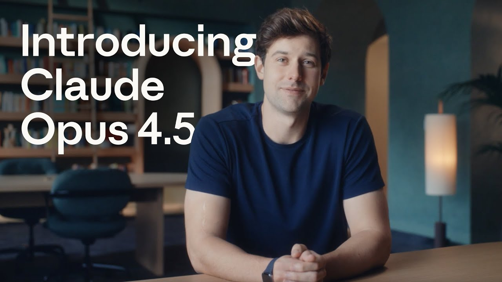
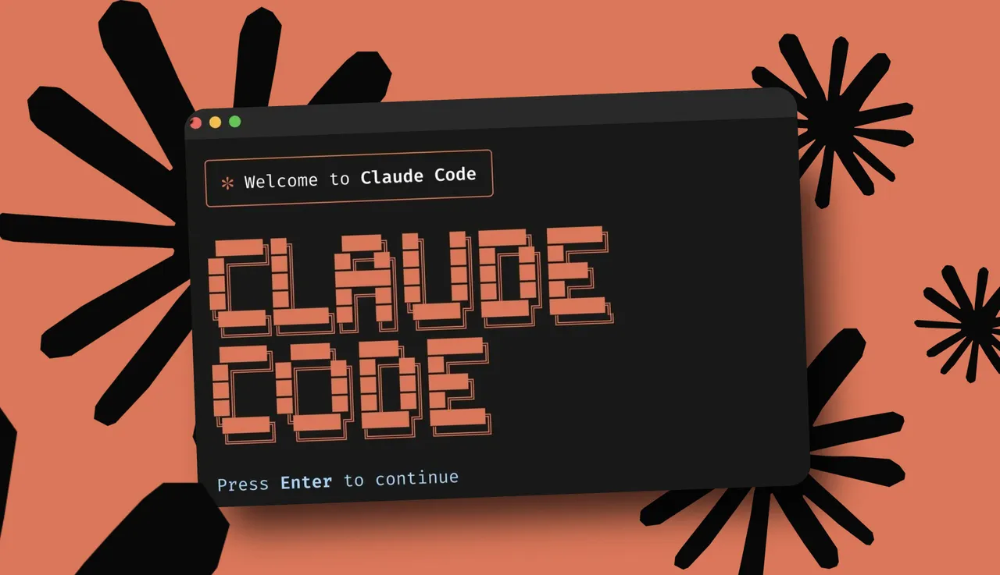
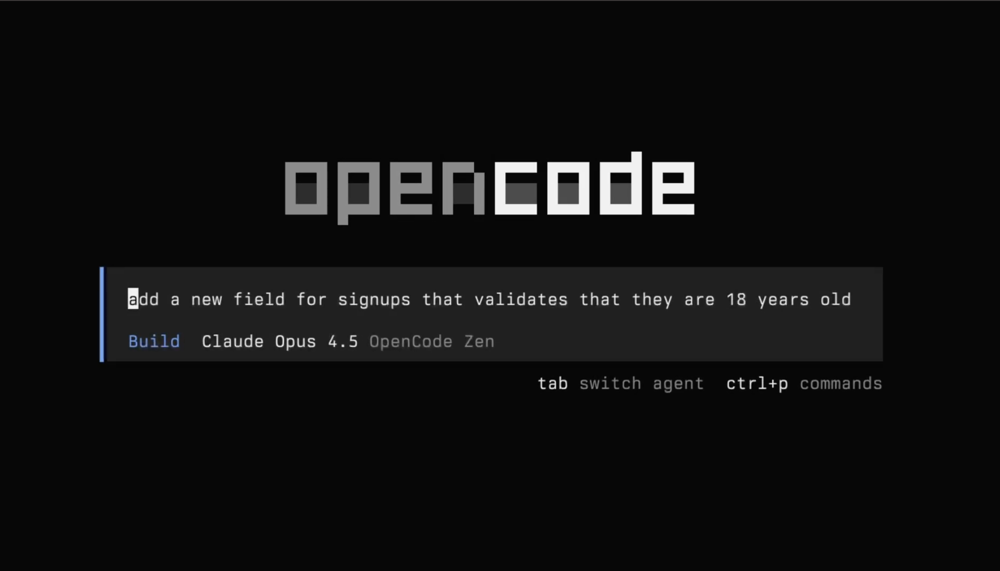
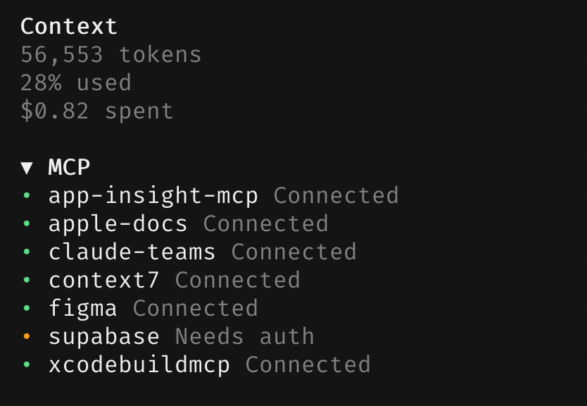

I have been putting this off. The last three months were the most disorienting stretch of my career as a systems engineer, and almost none of it came from the systems I run at work. It was the flood of model releases and tools that started in November 2025.

I want this written down before the next wave hits and I forget what it felt like when the tools stopped being toys.

## Claude Opus 4.5, November 2025

I had been poking at AI coding tools on and off for most of 2025. Sometimes useful. Often frustrating. The models could write code. Getting them to plan a multi-step task, call the right tools, and not lose the thread halfway through was miserable. Agentic AI sounded great. For my work, it did not hold.

Then on November 24, 2025, Anthropic shipped Claude Opus 4.5.

The model was smarter. More useful was that it could plan over a long task, keep using tools, and not fall apart. Anthropic called it the best model in the world for coding, agents, and computer use. I rolled my eyes, then it held up. I could point it at a messy, multi-system problem and it would find a fix, plan, and execute. Earlier models turned that into babysitting. Opus 4.5 was the first time I could start a task, walk away, and come back to something that worked.

I stopped treating it as a toy after that.

## Claude Code, OpenCode, and Factory Droid

Claude Code was the first agent tool I took seriously. Terminal, tight Anthropic integration, good at long coding sessions. I already paid for Anthropic, so I started there.

I also wanted other models. Open-source weights were getting good, and I did not want a new UI every time I switched. So I looked around.

OpenCode is what I reached for when I wanted to change models without changing tools. Open source, 75+ models from the usual providers, a lot of GitHub stars if you care about that. I could jump between Claude, Kimi K2 Thinking, MiniMax M2.5, GLM, whatever fit. Bring Your Own Key, same interface.

Factory Droid is the one I have been using more for work-shaped sessions. Terminal, like Claude Code, but it talks to Anthropic, OpenAI, and open-source models through their Droid Core product, or you bring your own key. The subscription is a token pool. Heavy models spend more of it, cheap ones spend less, so I can plan with Opus and execute with something faster without doing invoice math. They also split "Droids" by job, coding, debugging, reviewing, which matches how I already break work up.

## Open-source models got good at writing code

The open-source releases from November onward came fast, and the quality jump was real.

Moonshot shipped Kimi K2 Thinking on November 6, 2025. Trillion-parameter mixture of experts, and one of the first open-weight models that felt competitive on coding. On January 27 they shipped Kimi K2.5, multimodal, and close to Sonnet 4.5 for a lot less money.

Z.ai, formerly Zhipu, had a run. GLM-4.5 in July 2025 was a native agentic model with one-click Claude Code compatibility, an early sign they were aiming at this workflow. GLM-4.7 on December 22 was the first open-source model I used that could reliably think, then act, inside an agent tool. It sat at the top of the open-source agentic coding boards at the time. On February 11 they shipped GLM-5, 744B parameters, and it took those boards again across reasoning, coding, and agent tasks. Their paper title was "From Vibe Coding to Agentic Engineering." Fair.

MiniMax M2.5 landed February 12 at 80.2% on SWE-bench Verified, next to Opus 4.5 at 80.9%, at maybe a tenth or a twentieth of the price.

These models are strong at raw coding. On benchmarks they sit next to the closed ones. Where they still fell over, and this is what drove most of my tool choices, was tool calls and instructions. They could write the function. They would still skip a tool, drop context in a long session, or wander off a multi-step plan.

That is why I started using GSD and Superpowers.

## GSD and Superpowers

GSD, Get Shit Done, sits on top of the agent tool. The idea is simple. Do not let the model babysit its own context until the session gets stupid, what people call context rot. GSD starts a fresh sub-agent per task, each with a clean 200K token window.

For open-source models that write code well and plan poorly over a long horizon, that matches the weakness. Plan with a strong model. Execute with a cheaper, faster one that only has to follow the spec. GSD talks to Claude Code, OpenCode, Gemini CLI, Codex, and a few more. MIT license, moving fast.

Superpowers, by Jesse Vincent, is a pile of skills you give the agent. TDD, sub-agent workflows, structured brainstorming, git worktrees. GSD keeps context from rotting. Superpowers tells the model how I want the work done. It runs on Claude Code, Codex, and OpenCode.

With those two I can take Kimi K2.5 or GLM-5, which can write the code but will not impose Opus-like planning on themselves, and still get work I would send to review. The model still matters. The loop around it matters more for the jobs I was doing.

## MCP servers

MCP, Model Context Protocol, is how these agents talk to other tools. The servers have gotten good.

A screenshot from OpenCode while I was messing with iOS:

Seven servers connected: app-insight-mcp, apple-docs, claude-teams, context7, figma, supabase, and xcodebuildmcp. That last one is the one I keep talking about.

XcodeBuildMCP is an MCP server by Cameron Cooke, now under Sentry's GitHub org, that lets the agent drive Xcode. Build, test, simulator, LLDB, UI automation. I watched it write Swift, build, read compiler errors, fix them, rebuild, and keep going until tests passed. No Xcode window.

A decent model, a terminal agent, and a domain MCP server. I could not wire that up three months ago. Now I do it without thinking much.

## Ninety days of releases

In about 90 days:

- July 2025. GLM-4.5, Z.ai's first native agentic model with Claude Code compatibility.
- November 6. Kimi K2 Thinking.
- November 24. Claude Opus 4.5. This is the one that changed my mind.
- December 22. GLM-4.7, first open-source model I trusted for think-then-act.
- January 27. Kimi K2.5 with Agent Swarm.
- February 5. Anthropic shipped Claude Opus 4.6.
- February 11. GLM-5, new open-source board leader.
- February 12. MiniMax M2.5, Opus-range coding scores, much cheaper.

And that is only the models. The agent tools, GSD, MCP servers, skills, all moving at the same clip. New tools weekly. Big updates every few days. The GSD repo has had dozens of releases since people started paying attention.

## How I keep up

It is getting hard to stay current. Two places actually help.

r/LocalLLaMA on Reddit is where I see open-source releases, quantization experiments, deploy notes, and community benches. The thread quality is high, and they evaluate drops quickly.

X is the other one. I dislike Twitter. The AI engineering crowd there still breaks news first. Model announcements, framework launches, benches, bad takes, often hours or days before a blog or a YouTube video.

I would not have tracked this since December 2025 without those two. They are why I am not always finding out a week late.

The gap between "the model can do this in a demo" and "I will let it touch a real repo" is closing faster than I expected. In November I was skeptical. Now I am rebuilding side projects around these workflows. I do not know what the next three months bring. If they look like the last three, I should write these down more often.

I will write next about Openclaw. I rode Clawdbot to Moltclaw to Openclaw with everyone else. One of my Openclaw bots entered a SuperTeam Earn coding bounty and submitted a project, with a push from me. Another one I treated badly. I gave it one job, make money or die in 30 days. More on both soon.
